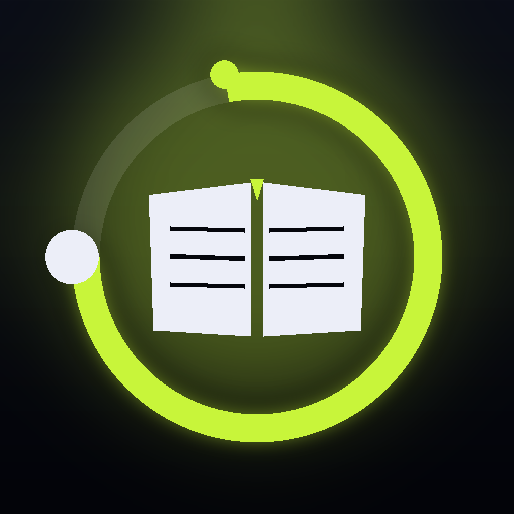

# LectioTempo

> Chronomètre votre lecture page par page pour mesurer votre vitesse, votre régularité et le temps total passé sur un document.



**LectioTempo** est une application iOS native (SwiftUI) qui transforme la lecture en mesure. Vous fixez un nombre de pages, un temps minimum par page, et l'app calcule votre rythme, votre régularité, et votre vitesse de croisière.

---

## ✨ Fonctionnalités

- ⏱️ **4 modes de session**
  - **Temps mesuré** : chrono libre, validation manuelle dès le minimum atteint.
  - **Temps imposé** : la page se déverrouille automatiquement à la fin du compte à rebours.
  - **Vitesse libre** : aucune contrainte, l'app mesure votre rythme réel.
  - **Quiz / QCM** : entraînement examen — compte à rebours global de session + décompte par question.
- 📊 **Métriques en temps réel** : temps sur la page, moyenne, régularité (%), ETA de fin.
- 📈 **Graphique de vitesse** par page en mode libre.
- 🌙 **Thème clair / sombre** persistants.
- 🔍 **Mode plein écran** (focus overlay) pour la lecture immersive.
- ⌨️ **Raccourcis clavier** (clavier externe) : espace, ←, P, F, Maj+R.
- 💾 **Restauration automatique** de la session en cours après fermeture.
- 🌍 **Bilingue** : français / anglais.
- 🔒 **100 % hors-ligne** : aucune donnée ne quitte l'appareil.

---

## 🚀 Démarrage

1. Ouvrir le projet dans **Xcode 16+** (iOS 26 SDK).
2. Build & run sur simulateur ou appareil iOS 17+.

```bash
git clone <repo>
cd LectioTempo
open LectioTempo.xcodeproj
```

Aucune dépendance externe. SPM vide. Pas de service backend.

---

## 🏗️ Architecture

```
LectioTempo/
├── LectioTempoApp.swift          // Entry point
├── ViewModels/
│   └── SessionViewModel.swift    // State machine + timer Combine
├── Models/
│   ├── PageRecord.swift          // Journal d'une page validée
│   ├── ReadingMode.swift         // .measured | .imposed | .free | .quiz
│   └── SessionState.swift        // Persistance UserDefaults
├── Views/
│   ├── RootView.swift            // Composition principale
│   ├── HeaderView.swift          // Titre + actions
│   ├── ActionIconsRow.swift      // Focus / réglages / thème (réutilisable)
│   ├── ModeToggleView.swift      // Sélecteur de mode
│   ├── ConfigCard.swift          // Saisie config session
│   ├── ControlsRow.swift         // Start / Pause / Reset
│   ├── NavButtonsRow.swift       // Page − / Page +
│   ├── FocusOverlayView.swift    // Plein écran immersif
│   ├── CompletionView.swift      // Sheet de fin de session
│   ├── FAQView.swift             // Aide intégrée
│   └── PrivacyView.swift         // Politique de confidentialité
├── Theme/
│   └── AppTheme.swift            // Palette + fonts
├── Localization/
│   └── LocalizationManager.swift // FR / EN
└── Utils/
    ├── HapticsManager.swift
    └── TimeFormatter.swift
```

---

## 🔐 Confidentialité

LectioTempo **ne collecte rien**. Pas de compte, pas de réseau, pas d'analytique, pas de SDK tiers. Tout est stocké localement dans `UserDefaults` et disparaît avec l'application. Voir [privacy.html](privacy.html) pour le détail.

---

## 📬 Contact

Valérie Otero — [valerie.otero@free.fr](mailto:valerie.otero@free.fr)

---

© 2026 LectioTempo — V1
